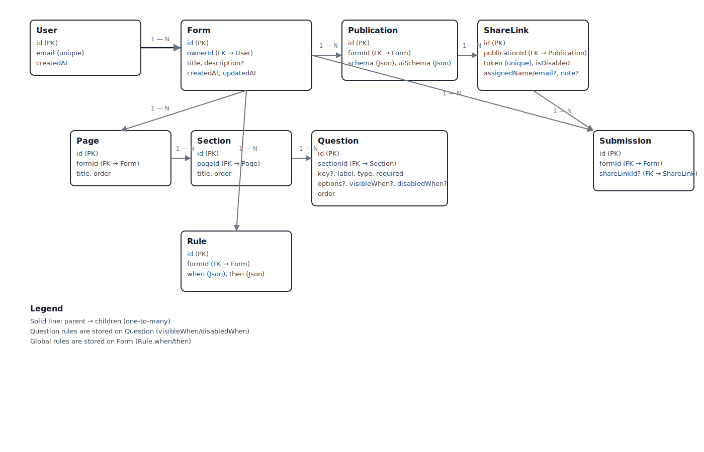

# JSON Form Builder & Runtime — Developer Guide

This app lets you build forms visually from a custom FormSpec, compile them into JSON Schema + UI Schema, publish immutable snapshots, generate share links, render public forms, and collect submissions.

- Author in a drag‑and‑drop builder (pages → sections → questions)
- Add conditional visibility/disable rules and global actions
- Compile to JSON Schema + UI Schema for @rjsf/core rendering
- Publish a snapshot (Publication) and share via links
- Accept and list submissions

Auth is skipped for this POC. A demo user (`demo@owner.local`) is auto‑created.

--------------------------------------------------------------------------------

**Tech Stack**
- Next.js 14 (App Router), React 18, TypeScript
- Prisma + PostgreSQL (Json columns)
- @rjsf/core (react‑jsonschema‑form) + AJV v8
- Tailwind CSS

--------------------------------------------------------------------------------

**Quick Start**
- Install: `npm i`
- Env: `cp .env.example .env` and set `DATABASE_URL`
- Prisma: `npx prisma generate && npx prisma migrate dev --name init`
- Dev: `npm run dev` then open http://localhost:3000

Optional AI form generation uses GROQ; set `GROQ_API_KEY` if needed (see .env.example).

--------------------------------------------------------------------------------

**How It Works**
- Build: The builder edits an in‑memory FormSpec and live‑previews it with @rjsf.
- Save: Clicking Save persists a normalized tree: Form → Pages → Sections → Questions (+ Rules).
- Publish: Compiles FormSpec to JSON Schema + UI Schema and stores a Publication snapshot.
- Share: Create share links for a Publication; each link has a unique token.
- Render: Public page `/f/{token}` fetches compiled schema/ui and renders via @rjsf.
- Submit: Submissions POST to an API and are stored against the link and form.

--------------------------------------------------------------------------------

**Core Domain and Data Model**
- User: Owner of Forms.
- Form: Authoring entity; contains Pages, Sections, Questions, and global Rules.
- Page → Section → Question: Normalized structure with explicit `order`.
- Rule: Global form rule that can set required, const, or restrict enums.
- Publication: Immutable snapshot of compiled `schema` and `uiSchema` for a Form.
- ShareLink: Public token for a Publication (optional assignee fields).
- Submission: Response payload for a given ShareLink/Form.

Prisma schema (relationships, key fields):
- `prisma/schema.prisma:1` Publication: belongs to Form; stores `schema`/`uiSchema` Json.
- `prisma/schema.prisma:11` ShareLink: belongs to Publication; unique `token`.
- `prisma/schema.prisma:28` User: owns many Forms.
- `prisma/schema.prisma:34` Form: belongs to User; has Pages, Rules, Publications, Submissions.
- `prisma/schema.prisma:47` Page: belongs to Form; has Sections; `order`.
- `prisma/schema.prisma:57` Section: belongs to Page; has Questions; `order`.
- `prisma/schema.prisma:69` Question: belongs to Section; has `key`, `type`, `options`, `visibleWhen`, `order`.
- `prisma/schema.prisma:86` Rule: belongs to Form; `when`/`then` stored as Json.
- `prisma/schema.prisma:95` Submission: belongs to Form and optional ShareLink; `payload` Json.

--------------------------------------------------------------------------------

**FormSpec (Authoring format)**
- Types: `src/types/formspec.ts:1`
- Defaults: `src/lib/formspec/defaults.ts:1`
- Validation: `src/lib/formspec/validators.ts:1`

Notes:
- Each question gets a human‑readable `key` (auto‑generated if missing) used for rules and output.
- Question‑level rules: `visibleWhen` and `disabledWhen` are lists of AND groups; groups are ORed.
- Global rules: top‑level `rules` array with `when` and `then` actions (set required, const, enum).

--------------------------------------------------------------------------------

**Builder (Authoring UI)**
- Shell: `src/components/builder/BuilderShell.tsx:1` — orchestrates builder panes.
- Canvas: `src/components/builder/BuilderCanvas.tsx:1` → `CanvasPage.tsx:1` → `CanvasSection.tsx:1` → `CanvasQuestion.tsx:1`.
- Inspector: `src/components/builder/Inspector.tsx:1` — edit label/help/key/required/options; opens field rules.
- Field Rules: `src/components/builder/RuleBuilder.tsx:1` — build `visibleWhen` / `disabledWhen`.
- Global Rules: `src/components/builder/ActionRules.tsx:1` — create top‑level rules.
- Preview: `src/components/builder/PreviewPane.tsx:1` — live @rjsf render of compiled spec.
- Save: `src/components/builder/SaveBar.tsx:1` — validates and POSTs Form tree to API.
- State/Compile: `src/hooks/useFormSpec.ts:1` and `src/lib/formspec/compile.ts:1`.

Key behaviors:
- `ensureKeys` auto‑generates valid `key`s and keeps them unique.
- Moving/deleting questions updates UI order and cleans rules referencing deleted questions.
- Rule builders coerce values (booleans/numbers/arrays) and store conditions consistently.

Entrypoints:
- New builder page: `src/app/templates/new/page.tsx:1`.
- Edit existing (example): `src/app/templates/[id]/builder/page.tsx:1`.

--------------------------------------------------------------------------------

**Compilation (FormSpec → JSON Schema + UI Schema)**
- Compiler: `src/lib/formspec/compile.ts:1`.
- Output: `{ schema, uiSchema }` suitable for @rjsf.

What happens:
- Maps each question to JSON Schema type, formats, and enums.
- Builds `required` and `ui:order` from the spec; preserves authoring order.
- Emits `ui:meta.idToKey` to translate old ids → keys for robust rule resolution.
- Copies question‑level `visibleWhen` / `disabledWhen` into both `uiSchema` and property `ui:options`.
- Converts top‑level rules into JSON Schema `allOf` with `if`/`then` blocks.

For a detailed walkthrough, see: `docs/compile-formspec-deep-dive.md:1`

--------------------------------------------------------------------------------

**Public Rendering and Rules Execution**
- Public page: `src/app/f/[token]/page.tsx:1` → loads by ShareLink token.
- Fetch compiled: `src/app/api/public/[token]/route.ts:1`.
- Runtime: `src/components/PublicFormClient.tsx:1`.

Runtime logic:
- Uses `@rjsf/core` with AJV v8 to render.
- Evaluates `visibleWhen` and `disabledWhen` on every change and hides or disables fields accordingly.
- Removes hidden fields from `required` and from any `then.required` to avoid submit blockers.
- Submits to `src/app/api/public/[token]/submit/route.ts:1` and stores a `Submission`.

--------------------------------------------------------------------------------

**Persistence Flow**
- Save Form: `src/components/builder/SaveBar.tsx:1` → `POST /api/forms` (`src/app/api/forms/route.ts:1`) creates Form + Pages + Sections + Questions + Rules.
- Publish: `POST /api/templates/[id]/publish` (`src/app/api/templates/[id]/publish/route.ts:1`) compiles current FormSpec and stores a Publication with `schema` + `uiSchema`.
- Share: `POST /api/publications/[id]/share-links` or create assigned links via `POST /api/publications/[id]/assigned-links`.
- Submit: `POST /api/public/[token]/submit` creates a Submission linked to ShareLink and Form.
- View: Owner dashboard pages
  - Home: `src/app/page.tsx:1` — lists Forms and Publications
  - Form detail: `src/app/forms/[id]/page.tsx:1`
  - Publication detail: `src/app/publications/[id]/page.tsx:1` — manage links and view submissions

--------------------------------------------------------------------------------

**API Overview**
- Forms
  - `GET /api/forms` list owner’s forms with full tree
  - `POST /api/forms` create new form from FormSpec parts
  - `GET /api/forms/:id` get form tree
  - `PUT /api/forms/:id` replace tree (transactionally recreates children)
  - `DELETE /api/forms/:id` delete form
- Templates (aliases to forms for this POC)
  - `GET /api/templates` list
  - `POST /api/templates` create
  - `POST /api/templates/:id/publish` compile + snapshot to Publication
- Publications
  - `GET /api/publications/:id` fetch one (owner scoped)
  - `DELETE /api/publications/:id` delete
  - `POST /api/publications/:id/share-links` create share link
  - `POST /api/publications/:id/assigned-links` create assigned link (name/email/note)
- Public
  - `GET /api/public/:token` get compiled schema/uiSchema for a share token
  - `POST /api/public/:token/submit` create Submission
- AI (optional)
  - `POST /api/ai/generate-form` generate JSON Schema from a prompt via GROQ

--------------------------------------------------------------------------------

**Database Setup**
- Set `DATABASE_URL` in `.env` (see `.env.example`).
- Migrate: `npx prisma migrate dev --name init`.
- Generate client: `npx prisma generate`.
- Seed/owner: code auto‑creates a demo owner on demand (`src/lib/owner.ts:1`).
- Utilities:
  - Clear dev DB: `ts-node scripts/clearDb.ts` (or built JS in `scripts/`).
  - Migration helper for legacy publications: `scripts/migrateFormSpecToNormalized.ts`.

Entity relationships:
- User 1—N Form
- Form 1—N Page 1—N Section 1—N Question
- Form 1—N Rule
- Form 1—N Publication
- Publication 1—N ShareLink
- ShareLink 1—N Submission; Submission also belongs to Form

--------------------------------------------------------------------------------

**Development Notes**
- Dev containers / Codespaces: `.devcontainer/devcontainer.json:1` auto‑installs deps and runs Prisma.
- Styling: Tailwind; global styles in `src/app/globals.css:1`.
- Prisma client: `src/lib/prisma.ts:1`.
- Owner resolution: `src/lib/owner.ts:1` (no real auth in POC).

--------------------------------------------------------------------------------

**Diagrams & Examples**
- ER Diagram image: `docs/er-diagram.svg`
- Detailed ER + end-to-end example: `docs/er-and-example.md:1`

--------------------------------------------------------------------------------

**Rules — Authoring vs Runtime**
- Field rules (RuleBuilder)
  - Authors create OR‑groups of AND‑conditions: an array of groups where each group has `all` (AND) and/or `any` (OR) conditions.
  - Stored on questions as `visibleWhen` and `disabledWhen` with field references by `key`.
- Global rules (ActionRules)
  - Authors define `when` (AND of conditions) → `then` actions (`setRequired`, `setConst`, `setEnum`).
  - Compiler turns them into JSON Schema `allOf` with `if`/`then` for @rjsf/AJV to enforce.
- Runtime resolution
  - Public renderer reads conditions from both `uiSchema` and schema `ui:options`.
  - Hidden fields are removed from required checks to prevent validation dead‑ends.
  - An `idToKey` map in `ui:meta` makes old id‑based references robust across edits.

--------------------------------------------------------------------------------

**Troubleshooting**
- No fields on publish: Ensure the form has at least one question and that validation passes before saving/publishing.
- Visibility rules not working publicly: Confirm the question `key`s exist and match in conditions; republish to refresh the snapshot.
- AJV errors on public form: Check `schema.allOf` and `required` lists; hidden fields are automatically excluded at runtime.
- DB errors locally: Verify `DATABASE_URL` and that migrations ran. Use `scripts/clearDb.ts` to reset dev data.

--------------------------------------------------------------------------------
